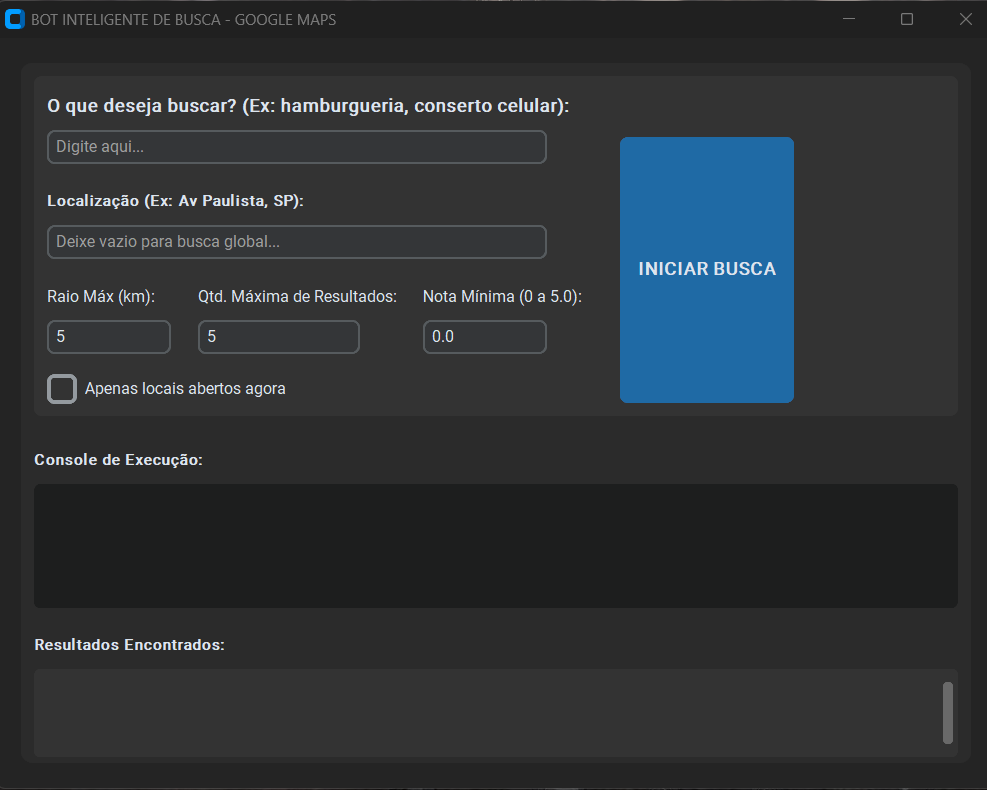
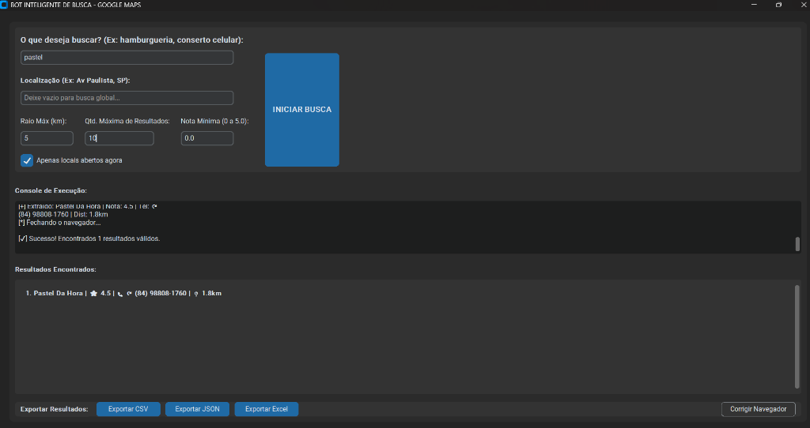

# 🗺️ Google Maps Intelligent Scraper Bot


Um **bot inteligente de automação para o Google Maps** capaz de pesquisar estabelecimentos automaticamente, interpretar buscas em linguagem natural com Inteligência Artificial e extrair dados comerciais estruturados.

Ideal para **prospecção de clientes, marketing local, análise de mercado e criação de bases de dados comerciais**.

---

# 📌 Visão Geral

O **Google Maps Intelligent Scraper Bot** automatiza pesquisas dentro do Google Maps e coleta dados relevantes dos estabelecimentos encontrados.

O usuário simplesmente descreve o que procura:

```
restaurantes que vendem batata frita perto de mim
```

ou

```
clínicas odontológicas em São Paulo
```

A Inteligência Artificial interpreta essa frase e transforma em uma **consulta otimizada para o Google Maps**, permitindo que o bot encontre resultados de forma muito mais eficiente.

Depois disso o sistema extrai automaticamente:

* 🏢 Nome do estabelecimento
* ⭐ Avaliação
* 📍 Endereço
* ☎️ Telefone
* 🕒 Status (aberto ou fechado)
* 📏 Distância do ponto de busca

Todos os dados são organizados e exportados em:

* **Excel (.xlsx)**
* **CSV**
* **JSON**

---

# 🖥️ Interfaces do Sistema

O sistema conta com duas interfaces completas para uso: Desktop e Web.

## 1. Interface Desktop (Original)
Interface nativa feita em CustomTkinter para rodar localmente como aplicativo.




## 2. Interface Web (Novo - Versão 2.0)
Aplicação moderna em HTML/CSS/JS com servidor backend em FastAPI. Possui um visual premium "Glassmorphism" com Dark Mode nativo.

* **Backend**: FastAPI gerencia as requisições, roda de forma assíncrona, e não interrompe o uso do PC (Playwright roda em modo `headless`).
* **Frontend**: Interface web bonita, com responsividade, animações e notificações em tempo real.

---

# 🚀 Principais Funcionalidades

✔ Pesquisa automática no Google Maps
✔ Interpretação de buscas com IA
✔ Extração automática de dados comerciais
✔ Filtro de distância por raio
✔ Detecção de estabelecimentos fechados
✔ Exportação em múltiplos formatos
✔ Interface moderna com Dark Mode
✔ Execução estável usando Playwright

---

# 🧠 Tecnologias Utilizadas

## Python

Linguagem principal do projeto, utilizada para automação, análise de dados e integração com IA.

---

## Playwright

Motor de automação web criado pela Microsoft.

Vantagens:

* extremamente rápido
* melhor controle de páginas dinâmicas
* menos erros de automação
* suporte a navegação assíncrona

---

## Inteligência Artificial (g4f)

Utilizado para interpretar a busca do usuário.

Exemplo:

Entrada do usuário:

```
tem algum lugar que venda torta perto de mim?
```

Consulta otimizada gerada pela IA:

```
restaurante torta perto de mim
```

Isso melhora drasticamente a qualidade da busca no Maps.

---

## Geopy

Utilizado para cálculos geográficos.

Permite:

* converter endereços em latitude/longitude
* calcular distância real entre pontos
* aplicar filtros por raio de busca

---

## CustomTkinter

Framework de interface gráfica moderno baseado em Tkinter.

Recursos:

* interface moderna
* modo escuro
* cantos arredondados
* melhor experiência visual

---

## Pandas + Openpyxl

Usados para organizar os dados e exportar arquivos Excel estruturados.

Isso evita problemas comuns de codificação que acontecem em arquivos CSV.

---

# ⚙️ Instalação

## 1. Clone o projeto

```
git clone https://github.com/seu-usuario/google-maps-bot.git
```

```
cd google-maps-bot
```

---

## 2. Criar ambiente virtual (recomendado)

```
python -m venv venv
```

Windows:

```
venv\Scripts\activate
```

Linux / Mac:

```
source venv/bin/activate
```

---

## 3. Instalar dependências

```
pip install -r requirements.txt
```

---

## 4. Instalar navegador do Playwright

```
playwright install chromium
```

---

## 5. Como Executar

Você tem duas opções para rodar o bot: como um App Desktop ou como um Servidor Web.

### Opção A: Iniciar o Sistema Web (Recomendado)

O sistema Web roda no seu navegador e não abre janelas irritantes durante a extração.

```bash
uvicorn maps_bot.api:app --reload
```
*Acesse `http://localhost:8000` no seu navegador.*

### Opção B: Iniciar o App Desktop (Original)

```bash
python maps_bot/gui.py
```

---

# 🧩 Estrutura do Projeto

```
google-maps-bot
│
├── maps_bot
│   ├── api.py                 # Servidor Backend (FastAPI)
│   ├── gui.py                 # Interface App Desktop Original
│   ├── ai_interpreter.py      # IA para melhorar buscas (g4f)
│   ├── maps_search.py         # Automação do Google Maps (Playwright)
│   ├── scraper.py             # Raspagem de dados
│   ├── formatter.py           # Exportador JSON/CSV/Excel
│   │
│   └── frontend               # Interface Web (HTML/JS/CSS)
│       ├── index.html
│       ├── style.css
│       └── script.js
│
├── docs
│   └── images
│
├── requirements.txt
└── README.md
```

---

# 🔄 Fluxo do Sistema

1️⃣ Usuário digita o que deseja pesquisar
2️⃣ IA interpreta a frase
3️⃣ Sistema gera consulta otimizada para o Google Maps
4️⃣ Playwright abre o navegador automaticamente
5️⃣ O scraper percorre os resultados
6️⃣ Dados são coletados e filtrados
7️⃣ Resultados são exportados para Excel / CSV / JSON

---

# 📊 Exemplos de Uso

## Prospecção Comercial

Encontrar restaurantes de uma cidade para oferecer serviços.

```
restaurantes hamburguer natal rn
```

---

## Marketing Local

Criar lista de contatos de clínicas odontológicas.

```
clinicas odontologicas recife
```

---

## Pesquisa de Mercado

Mapear concorrentes em determinada região.

```
academias em fortaleza
```

---

# 🛣️ Roadmap

### ✅ Versão 1.0 (Concluída)

* Automação do Google Maps
* Extração de dados
* Exportação para Excel
* Interface gráfica nativa (CustomTkinter)

### ✅ Versão 1.5 (Concluída)

* Filtros avançados de distância e nota mínima
* Organização avançada de painéis de GUI
* Correção de módulos de IA

### ✅ Versão 2.0 (Atual - Concluída)

* API REST Completa (`FastAPI`)
* Dashboard Web Frontend (`HTML/CSS/JS` Vanilla Glassmorphism)
* Execução invisível (`headless` true) na web
* Processamento assíncrono

### 🔜 Versão 3.0 (Futuro)

* SaaS completo
* Painel online logado
* Multiusuários
* Sistema de créditos
* Banco de Dados na Nuvem (PostgreSQL)

---

# 📝 Histórico de Modificações (Changelog)

Abaixo o histórico passo a passo de todas as modificações desde a criação do projeto original:

### **[v2.0.0] - Migração para Web Application**
* **Criação da API Backend**: Implementado novo servidor em Python `FastAPI` via `api.py`.
  * Criação de rota assíncrona para não travar a UI durante o processamento longo do Playwright.
  * Migração do fluxo do Scraper para um ambiente server-side puro (com `headless=True`).
  * Endpoints RESTful para consultar status da execução de forma progressiva (Log streaming).
  * Backend servindo diretamente os arquivos estáticos do frontend.
* **Criação do Frontend**: Interface gráfica redesenhada para Web mantendo o poder anterior.
  * Estrutura pura e muito veloz com `index.html`, `style.css` e `script.js`.
  * Visual super premium com tema escuro (Dark Mode) inspirado em *Glassmorphism*.
  * Barra de status e console de logs em tempo real na própria página Web.
  * Geração instantânea de "Cards" com os resultados da pesquisa e botões instantâneos (Exportar CSV, JSON, Excel).
* **Dependências**: Adição do `fastapi`, `uvicorn` e `pydantic` ao `requirements.txt`.

### **[v1.5.1] - Melhorias de UX e Conselhos de UI no Desktop**
* Redimensionamento de painéis (`PanedWindow` widget) para permitir ao usuário ajustar o tamanho da área de console de texto versus a lista de resultados visuais no `gui.py`.

### **[v1.1.0] - Refatoração e Correções de Importações**
* Refatoração completa na gestão de importações de ambiente (`python-dotenv`) essenciais para proteger chaves de APIs.
* Resolução do erro de importação relacionado a `g4f.client` dentro do interpretador de intenções baseadas em IA (`ai_interpreter.py`).
* Modularização das rotinas em `main.py`, `maps_search.py`, `scraper.py`, `formatter.py`, `ai_interpreter.py`.

### **[v1.0.0] - Lançamento Original**
* Criação de robô em `Playwright` e `BeautifulSoup`.
* Interpretação usando Modelos de Linguagem para otimizar busca dos usuários.
* Interface inicial em `CustomTkinter` gerando resultados e logs num app exe desktop.
* Exportadores construídos nativamente para conversores Pandas e Json.

---

# 💼 Versão Comercial

Este projeto também pode ser transformado em um **produto comercial**.

Possíveis modelos:

* software de geração de leads
* ferramenta de marketing local
* plataforma SaaS de prospecção
* sistema de análise de mercado

Possíveis recursos premium:

* exportação ilimitada
* múltiplas cidades simultâneas
* automação em massa
* API para integração

---

# 🤝 Contribuição

Contribuições são bem-vindas!

Você pode ajudar com:

* melhorias de código
* correção de bugs
* novas funcionalidades
* otimização de performance

---

# 📄 Licença

Este projeto está sob a licença **MIT**.

Você pode usar, modificar e distribuir livremente.

---

# ⭐ Apoie o Projeto

Se este projeto foi útil para você:

⭐ Deixe uma estrela no repositório
🍴 Faça um fork
📢 Compartilhe com outras pessoas
